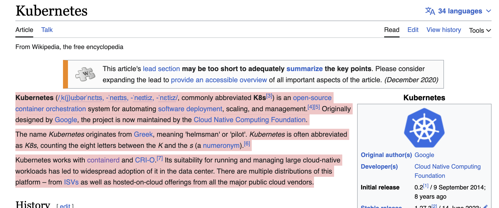
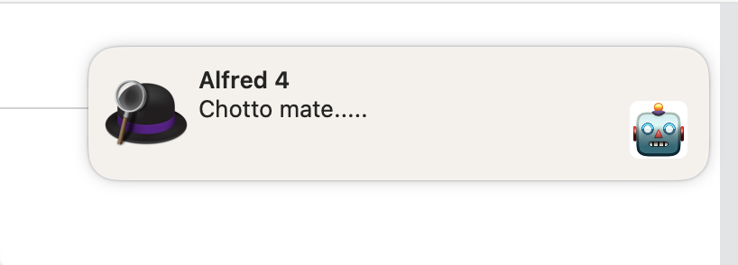
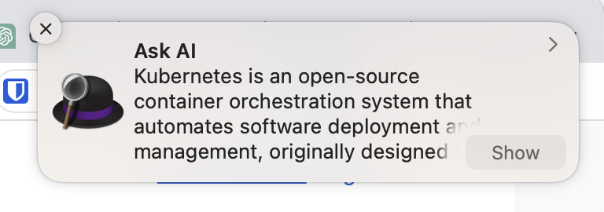

# tl:dr cybernetic enhanced summarization

Copy some text, hit the key-combination and get one step closer to the `singularity`
 
## Installation
1. Download the [latest release](https://github.com/spielhoelle/tldr-ai-assistant/raw/main/tl%3Bdr.alfredworkflow)
2. Import to alfred
3. Set your API key and desired model in the workflow variables
4. Copy some complicated text

4. Hit `ctrl+alt+v` (can be adjusted in the workflow settings)
5. Wait a second

6. You get a notification with the result and large text result

## TODO
- [ ] Error handling
- [ ] Better notifications
- [ ] Better text formatting
- [ ] Self hosted llama2-llm over python endpoint instead of open-ai API 💰 🙅‍♀️
- [ ] More use-cases like: 
	- [ ] summarize the current tab in browser
	- [ ] explain code snippet
	- [ ] answer emails and triage todo's
	- [ ] integrate with Voice Control
- [ ] Don't come to late to the [ robot-internet party ](https://www.theverge.com/23753963/google-seo-shopify-small-business-ai)
